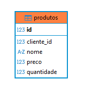

# CRUD_CADASTRO_DE_PRODUTOS_CLEAN_ARCH_HEXAGONAL

### Esse CRUD foi desenvolvido utilizando conceitos de Clean Architecture onde explorei as melhores formas de aplicar esse pattern,foi criada de forma desacoplada porem ligada com outra api CRUD_CADASTRO_DE_PESSOAS_CLEAN_ARCH_HEXAGONAL, onde uma pessoa logada nesse sistema pode cadastrar, consultar e alterar produtos.
.


## Requisitos:
- apache-maven-3.9.9 - [Download](https://maven.apache.org/download.cgi)
- Java 17 - [Download](https://www.oracle.com/java/technologies/javase/jdk17-archive-downloads.html)
- FrameWork - Spring Boot 3.3.0
- Docker Desktop (Rancher Desktop) - o banco foi configurado em um docker-compose. yml e esta no repositorio [CRUD_CADASTRO_DE_PESSOAS_CLEAN_ARCH_HEXAGONAL](https://github.com/lucasscardoso/CRUD_CADASTRO_DE_PESSOAL_CLEAN_ARCH_HEXAGONAL).
- Comandos basicos de docker - [Link](https://github.com/lucasscardoso/Docker)
-  você pode alterar o application.properties para utilizar o banco de sua escolha,originalmente ele está configurado para utilizar o PostgreSql 18 em uma imagem baseada no Alpine Linux.


## Core

- core/product/entity: Entitdade da aplicação.
- core/product/service: Casos de Uso (Salvar produto).
- core/user/repository: Interface de Repositorio (Regras para funcionamento do repository.) e repositorio externo onde "conversamos" com a api externa.
- core/shared: Tudo que é compartilhado no core,exceptions,DTO, records,useCase(Interface para padronizar as services com entradas e saidas).


## External
- externals/auth/cryptograia: Implementações de PasswordEncoder do core (Realiza a criptografia da senha utilizando bcrypt, optei dessa forma para que meu core nao dependa de dependencias externas).

- externals/config: ProductConfig foi criado para conseguir referenciar no caso de uso os dois repositorios, o externo para realizar operações com a api externa e o repo do core.
- externals/config/feignConfig: FeignClientConfig, criado para configurar interceptors do feign .
- externals/controllers: Controllers da aplicação.
- externals/db: Possui implementacao dos adapters para persistencia dos dados(ProductDbAdapter) e para consultas na api externa(UserDbAdapter) onde ficam as chamadas e regras.
- externals/entity: entidade espelho do core, serve para o mapeamento JPA.
- externals/interfaces/IUserExternalApi: onde é configurado o feign e sua rota para utilizar a api externa.
- externals/repository: Interface que implenta o JPA.
- externals/security/auth: possui o metodo onde validamos o token recebido da api externa e realizamos a validação do mesmo.
- externals/security/interceptor: configurado o interceptor do feign para conseguir capturar o token.
- externals/security: securityConfig e securityFilter da aplicação.

### Esquema relacional da tabela:
### Caso você não queira utilizar via docker-compose,segue codigo para criação da tabela.
### Por serem aplicações distintas,porem compartilhando o mesmo banco em caso de teste/estudo, não foi criada a FK para cliente_id, pois a aplicação de produtos "não conhece" a aplicação de Users seguindo os padrões da arquitetura hexagonal.
<details>
  <summary>Clique para ver o SQL de criação das tabelas</summary>

  ```sql
CREATE TABLE public.produtos (
	id int8 GENERATED BY DEFAULT AS IDENTITY( INCREMENT BY 1 MINVALUE 1 MAXVALUE 9223372036854775807 START 1 CACHE 1 NO CYCLE) NOT NULL,
	cliente_id int8 NOT NULL,
	nome varchar(255) NOT NULL,
	preco float8 NOT NULL,
	quantidade int4 NOT NULL,
	CONSTRAINT produtos_pkey PRIMARY KEY (id)
);

````


